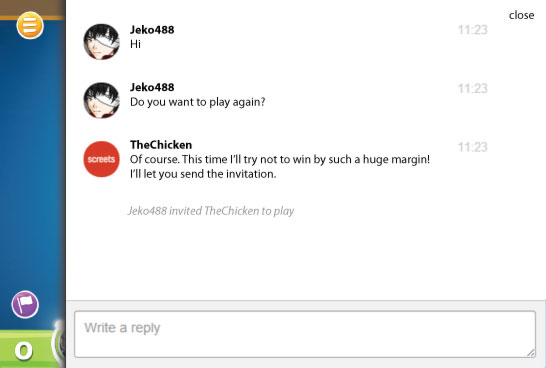

# starling-chat-console
A chat console for starling

A starling/feathers based chat console that can be integrated within a mobile application (AIR) and Facebook (Flash), developed in pure actionscript.

**The below isn't implemented, it's only a specification.**

### Usage

1. Clone the repo.
1. Add the repo's `src/` folder to your project's source-path.
1. Implement your own `ChatServer`.
1. Instanciate the ChatConsole and add it to your scene.

### User Interface



### API

```actionscript
package fovea.chat;

public class ChatMessage {

  // user that sent this message
  public var username:String;

  // URL of the avatar image (always a square)
  public var avatarURL:String;

  // message text
  public var message:String;

  // current state of the message (see const below)
  public var state:int;

  public static const STATE_IN_PROGRESS:int = 0;
  public static const STATE_SUCESS:int = 1;
  public static const STATE_FAILED:int = 2;
}

public interface IChatServer {

  // initiate sending a message
  function send(message:String):void;

  // return the list of messages on the chat room
  function getData():Vector<ChatMessage>;

  // listeners functions will be called without arguments
  // when data is updated.
  function addListener(f:Function):void;
  function removeListener(f:Function):void;
}

public class ChatConsole extends Sprite {

  public function ChatConsole(server:IChatServer) {}

  // make the console appear on screen (animated from right)
  public function show():void;

  // make the console disappear from screen (animated to the right)
  public function hide():void;
}
```
